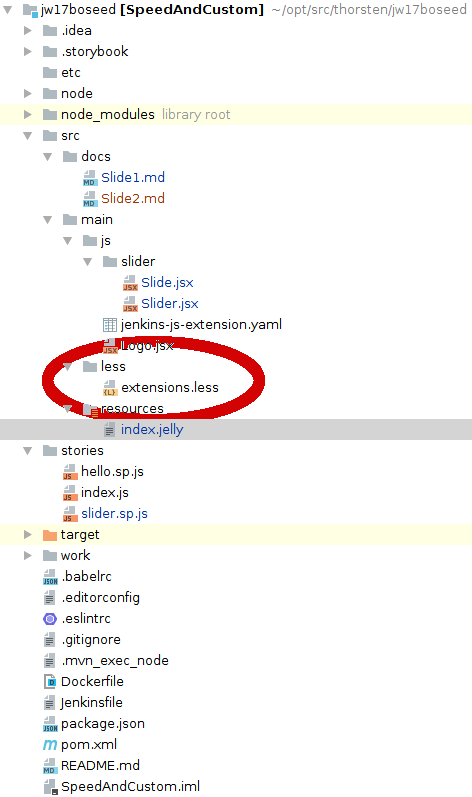

## Pimp my Blue Ocean

### create a custom plugin 

We will use [JenkinsWorld 2017 BO seed](https://github.com/scherler/jw17boseed)

### customize Blue Ocean
 - with custom css
 - custom components

## Plugin Anatomy
​


## How to Implement a Client-Side (JavaScript) Extension Point


1. `jenkins-js-extension.yaml` - Extension Point definition file. 
Needs to be placed in `src/main/js` (the root of your JavaScript source).   
1. The `.jsx` component file that implements the Extension Point.
Placed relative to `jenkins-js-extension.yaml`. The `.jsx` file contains a [React] component needs `export default class Logo extends Component`. 

## jenkins-js-extension.yaml

The implementation of an extension point is declare/define in `jenkins-js-extension.yaml` in order "picked up" by Blue Ocean. 

```yaml
#
# Extension point implementations in this plugin.
#
# This file tells Blue Ocean what Extension Point components are in this
# plugin + what extension points they implement.
##

extensions:
  - component: Logo
    extensionPoint: jenkins.header.logo
```


## Logo.jsx

```javascript
import React, { Component, PropTypes } from 'react';
import { Icon } from '@jenkins-cd/react-material-icons';

export default class Logo extends Component {
    render() {
        // return the component
        return (<a className="MasterLogo BlueOceanLogo MyLogo">
            <Icon icon="favorite" size={50} />
            my{ this.props.children }
        </a>);
    }
}
Logo.propTypes = {
    children: PropTypes.any,
}
```

## Add Style using LESS



1. `mkdir src/main/less`
1. `touch extensions.less`

```less
.MyLogo{
  border-bottom: 2px outset red;
  background-color: #c7ddef;
}
.BlueOceanLogo svg, .BlueOceanLogo:hover svg{
  height: 50px;
}
```
